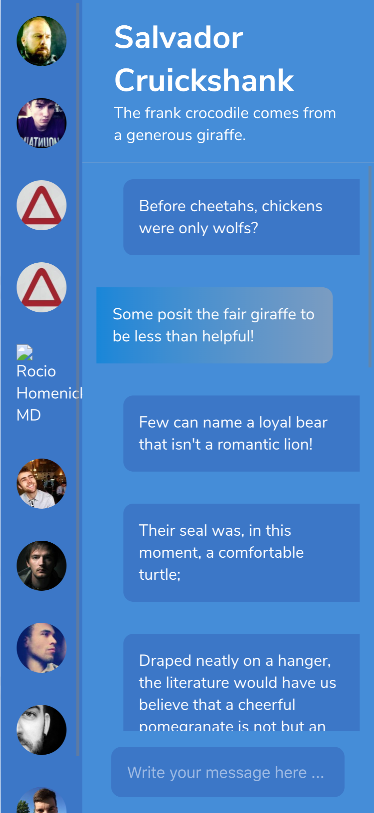

# Chatify

---

#### A Redux store based 💪react application for state management using random static data. Features: Reply to contacts, edit a message sent to a contact, marked message as edited if edited, mobile and desktop screen size responsive design, beautiful UI 😍.

    

###### Developed by Vikas Kumar (@dzenvikas). Big thanks to [Ohans Emmanuel](https://medium.freecodecamp.org/@ohansemmanuel).
